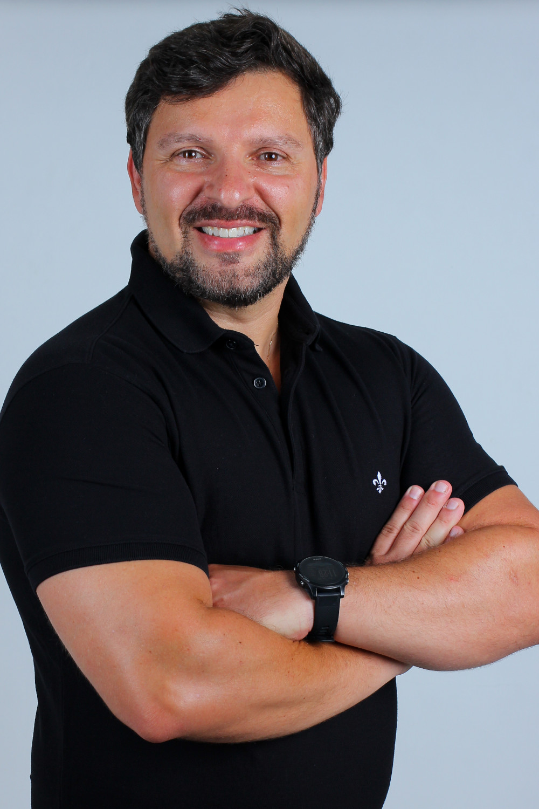

<h2 align="center">Portfólio digital de André Salerno

<h5 align="center">Orientador: Fabrício Galende Marques de Carvalho</h4>

<h3><bold>Tecnologias utilizadas</bold></h3>

<ul>
<li>Git</li>
<li>GitHub</li>
<li>Markdown</li>
<li>CSS</li>
<li>Boostrap</li>
<li>HTML</li>
<li>Python</li>
</ul>

<h3><bold>Execute a aplicação</bold></h3>
<ol>
<li>Certifique-se de ter o Python instalado em sua máquina</li>
<li>Recomendo usar uma IDE (preferencialmente VSCODE)</li>
<li>Certifique-se de ter o Python instalado em sua máquina</li>
<li>Crie um ambiente virtual usando o seguinte comando:</li>
    python -m venv .venv
<li>Ative esse ambiente:</li>
    ./venv/Scripts/activate
<li>Instale as dependências:</li>
    pip install requirements.txt

    obs.: certifique-se de estar no diretório correto para a execuação do código acima
<li>Clone o projeto em sua máquina</li>
    https://github.com/andresalerno/portfolio_digital.git
<li>Na pasta flask-app executar:</li>
    flask --app __init__ run --debug
<li>Clique no link que aparecerá no terminal e navegue pelo site</li>
<li>Para finalizar, clique neste mesmo terminal o CTRL + C que encerrará esse procedimento localmente</li>
</ol>

Validação  OK - Fabrício Galende Marques de Carvalho 2024/01
